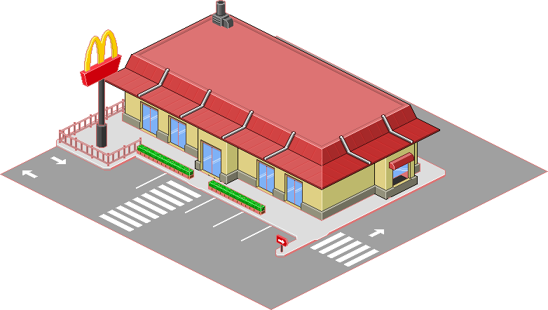
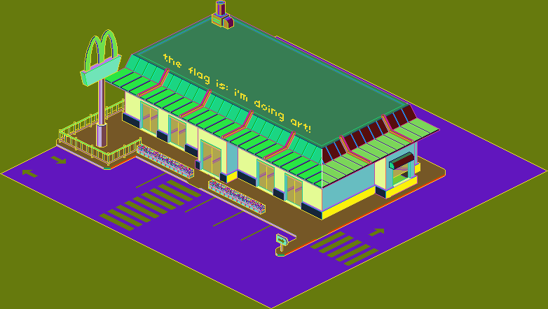
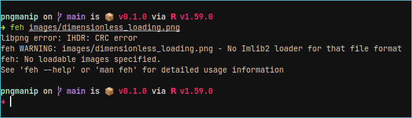
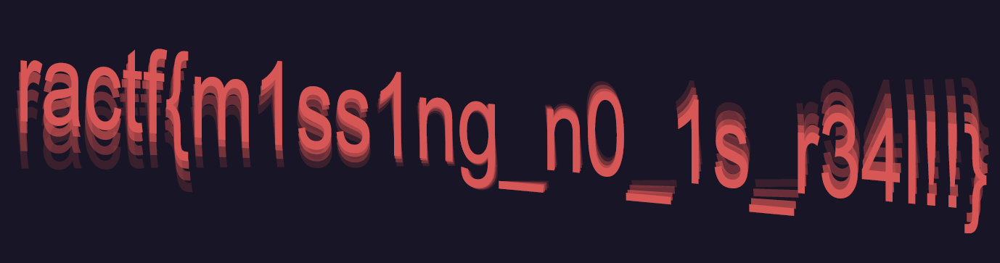
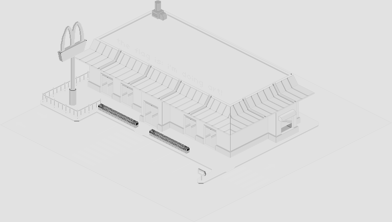

# pngmanip

A simple rust library for parsing and manipulating PNG images, primarily at the chunk level.

The intended use case was for solving PNG based CTF challenges, which often feature PNG images which have been corrupted in specific ways.
Such as by removing the width/height from the IHDR chunk, or by hiding text using duplicate entries in the palette chunk.

I have written example solutions for both these style of challenges, as well as provided example challenge files.

### Examples

#### Duplicate PLTE chunk entries
The solution for this kind of challenge is generally to just fill the PLTE chunk with random data and re-calculate the chunk CRC.
This will distort the colours of the image, but the duplicated ones will now look different:

`cargo run --example randomise_plte_chunk --release -- images/bob_ross.png`

#### Erased width and height
The solution for this kind of challenge is to use the fact the IHDR's CRC value is still correct, meaning we can brute force image dimensions and verify the correct ones using the CRC.

The provided example tries widths/heights up to 10,000, reducing this number should significantly speed up runtime.
Note: the example takes around a second on my laptop.

`cargo run --example recover_dimensions_from_ihdr_crc --release -- images/dimensionless_loading.png`

#### Removing PLTE chunk
The final example is just to demonstrate what is possible with the library.
While reading the PNG specification I noticed that images with a color type of palette, and images with a colour type of grey scale and a bit depth of 8, actually have the same sample format: a single 8 bit value.
In the palette case its an index, and in the other its just an 8 bit greyscale value. So I had the idea to remove the PLTE chunk from an image just to see what it would look like.

